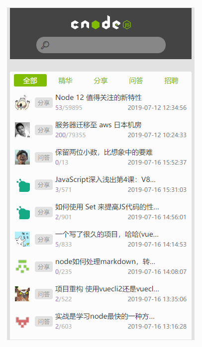
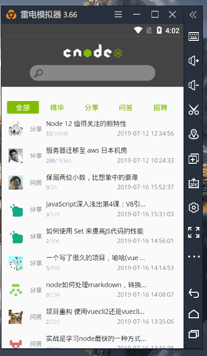

# cnode社区uni-app版

cnode社区uni-app版

> 数据api来源cnode公开api,地址： https://cnodejs.org/api
>
> axios风格的request封装改造自 [SnoopyChen](https://ext.dcloud.net.cn/publisher?id=1260)的`封装的request网络请求`：https://ext.dcloud.net.cn/plugin?id=159

## 特性

- Api统一管理（支持请求响应拦截器）
- 兼容3个端
- 覆盖全局的错误提示
- uni-app内 npm 包安装使用
- 下拉刷新
- 友好的体验

## 完成功能

- [x] 首页列表展示
- [ ] 首页其他页面
- [x] 分类切换
- [x] 上一页下一页
- [x] 下拉刷新
- [x] 详情
- [ ] 搜索

## 更新日志

2019-07-16 完成首页列表，详情界面

## 兼容端

采用uni-app多端发布，后续在app端计划采用weex进行原生开发

### H5

### 微信小程序

### App

